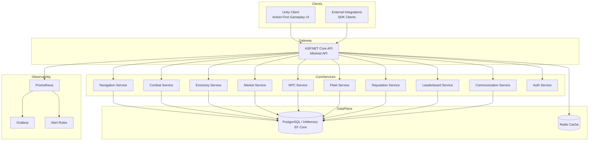
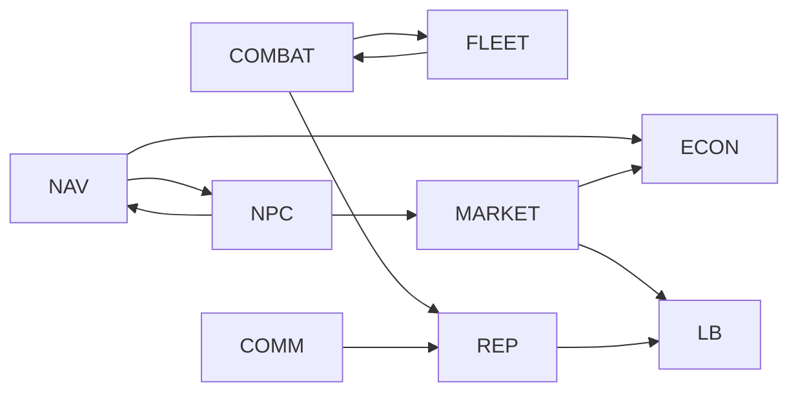
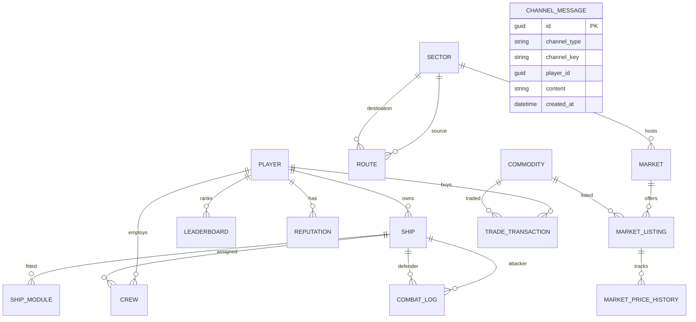
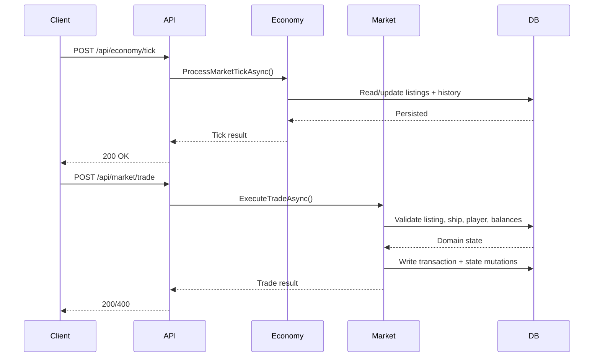
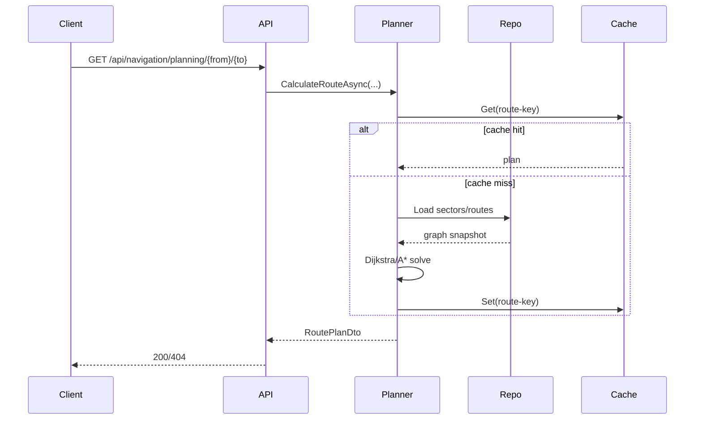
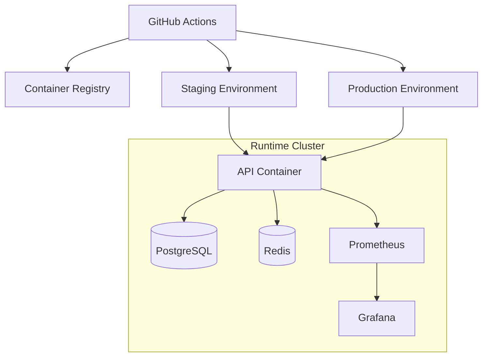

# Architecture Documentation

## Status
Complete

## System Architecture Diagram

## Service Interaction Diagram

## Database Schema (ERD)

## Sequence Diagrams

### Trading workflow sequence

### Navigation planning sequence

## Deployment Architecture

## Service Responsibilities
- API Gateway: Routing, serialization, endpoint composition, telemetry middleware.
- Auth Service: Registration/login/token validation for dev and E2E workflows.
- Navigation Service: Sector graph storage, route CRUD, Dijkstra/A* planning, autopilot.
- Combat Service: Tick-based deterministic combat simulation and combat log persistence.
- Economy Service: Dynamic price model, market tick updates, volatility and shock handling.
- Market Service: Trade execution, reversal, anti-exploit checks, transaction history.
- NPC Service: Archetype-based decisions, fleet spawn/movement/trading.
- Fleet Service: Ship templates, purchase, module fitting, crew progression, convoy simulation.
- Reputation Service: Faction and alignment standing updates plus decay.
- Leaderboard Service: Rank recalculation, history, position snapshots, resets.
- Communication Service: Channel subscriptions, moderation/rate limits, websocket and voice signaling.

## Scaling Strategy
- API horizontal scaling via stateless app instances.
- Redis for distributed cache/session acceleration.
- Background telemetry refresh isolated from request path.
- Read/write split path ready for PostgreSQL replicas.
- Queue-ready boundaries around combat ticks, market ticks, and NPC cycles.
- Benchmark workflow for recurring regression checks.

## Deployment Guide
- CI/CD flow and scripts: `docs/deployment-cicd.md`
- Staging env template: `infrastructure/staging.env.example`
- Production env template: `infrastructure/production.env.example`
- Rollback script: `scripts/rollback.sh`

## Configuration Options
| Area | Setting | Description |
|---|---|---|
| ASP.NET Core | `ASPNETCORE_ENVIRONMENT` | Environment selection (`Development`, `Testing`, `Staging`, `Production`) |
| Database | `ConnectionStrings__Default` | PostgreSQL connection string; fallback to in-memory when missing |
| Redis | `Redis__Connection` | Cache/session backend connection |
| Keycloak | `Keycloak__ServerUrl` | External IdP endpoint for production auth integration |
| Vault | `Vault__Enabled` / `Vault__Address` / `Vault__Token` / `Vault__Path` | Optional HashiCorp Vault secret bootstrap at API startup |
| Metrics | `PROMETHEUS_*` | Prometheus scrape and alert configuration via infrastructure files |
| Deployment | `DOCKER_IMAGE_TAG` | Image tag used by deploy workflow scripts |

## Troubleshooting Guide
- API starts but endpoints return empty data:
  Ensure persistence is configured; without `ConnectionStrings__Default`, the API uses an in-memory database.
- Swagger unavailable:
  Verify environment is `Development` or `Testing`, then open `/swagger`.
- E2E tests time out:
  Confirm `dotnet run --project src/API --urls http://127.0.0.1:5188` is reachable.
- Coverage gate failing in CI:
  Run unit tests locally with coverage parameters and inspect uncovered service paths.
- High latency in route/combat operations:
  Check Grafana dashboards and `RouteCalculationDuration` / `CombatTickDuration` metrics.
- Messaging websocket disconnects:
  Validate `playerId` query string and channel type/key formatting.
